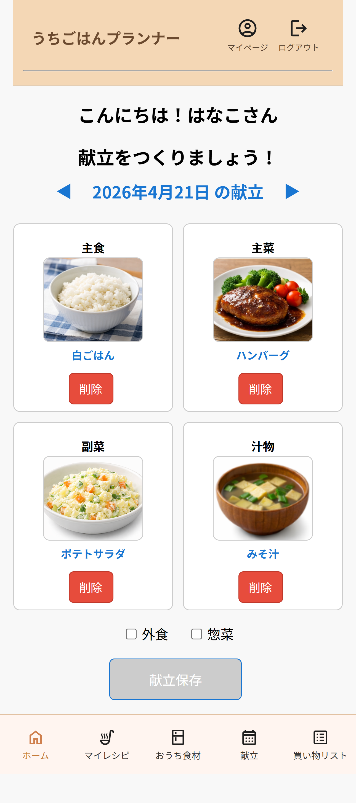
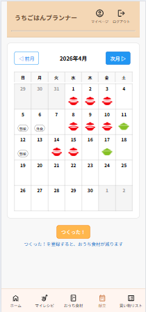
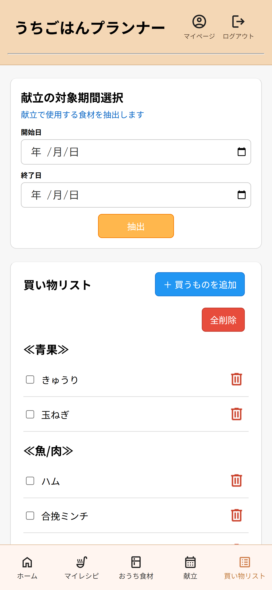

# うちごはんプランナー

## 概要

うちごはんプランナーは、献立作成から買い物、食材管理までを一元的に行える家庭向け料理管理アプリです。

献立を作成することで、必要な食材を自動で抽出し、不足分を買い物リストとして一覧化できます。
また、「おうち食材」を登録することで在庫を考慮した買い物ができ、食材の重複購入やフードロスを防ぐことができます。

「献立 → 買い物 → 調理」の流れを一体化し、日々の料理を効率化することを目的としたWebアプリです。

---

## 作成の目的

仕事と家庭を両立する中で、食事に関する家事負担が大きいと感じていたため、献立作成・買い物・食材管理といった一連の作業負担を軽減することを目的として開発しました。

特に、思いつきの買い物による食材の重複購入やフードロスを減らし、家事の効率化と家計・環境への負担軽減を目指しています。

---

## 主な機能

### ユーザー管理機能
- ユーザー登録 / ログイン / ログアウト
- ニックネーム / メールアドレス / パスワードの変更
- パスワードリセット（メール送信）

### レシピ管理機能
- レシピの登録 / 編集 / 削除
- 材料・作り方の登録
- レシピURLの保存
- 分量換算機能（倍率選択式）

### 献立管理機能
- 日付ごとの献立作成 / 編集 / 削除
- 主食・主菜・副菜・汁物の管理
- 外食 / 惣菜の設定
- カレンダー表示

### 買い物リスト機能
- 献立から必要な食材を抽出
- おうち食材を除外したリスト生成
- カテゴリ別表示
- 購入済みチェック機能

### 食材管理機能
- おうち食材の登録 / 削除
- 購入済み食材の自動追加
- 使用済み食材の削除（つくった機能連動）

---

## 使用技術

- バックエンド：Python / Django
- フロントエンド：HTML / CSS / JavaScript
- データベース：SQLite
- 開発環境：VS Code
- バージョン管理：Git / GitHub

---

## 工夫した点

- 献立作成を起点に、買い物・食材管理まで一連の流れをつなげた設計
- おうち食材を考慮した買い物リスト生成による重複購入の防止
- 分量換算を選択式にすることで、操作の簡単さと実用性を両立
- 外食・惣菜を設定できる柔軟な献立管理
- CSSの整理と共通化によるUIの統一

---

## 今後の課題

- 食材の数量管理への対応
- UI/UXのさらなる改善
- レシピ登録の簡略化（OCRや自動取得など）
- モバイル操作性の向上

- ## 画面イメージ

### ホーム画面

### 献立画面

### 買い物リスト

